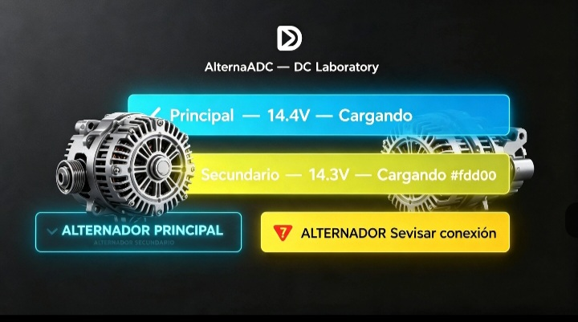
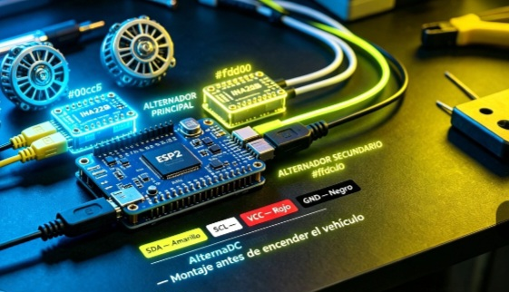
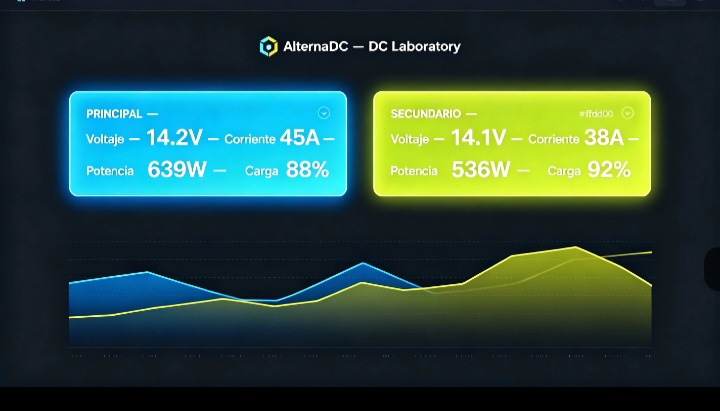

# ⚡ AlternaDC
### Monitoreo de Energía — DC Laboratory

Sistema independiente para monitorear **dos alternadores** en tiempo real. Sin internet, desde tu celular o cualquier navegador.

---

## 📊 Tablero en Vivo

| Canal | Color | Qué mide |
|---|---|---|
| 🟦 **Principal** | Azul neón | Voltaje · Corriente · Potencia · Energía · % Carga |
| 🟨 **Secundario** | Amarillo neón | Voltaje · Corriente · Potencia · Energía · % Carga |

---

## 🔌 Conexión

- **INA226 #1** → Dirección `0x40` → Alternador Principal 🟦
- **INA226 #2** → Dirección `0x41` → Alternador Secundario 🟨
- **ESP32** → Recibe datos por I2C → transmite por WiFi
- Accede desde: `http://192.168.4.1`

---

## 📈 Comparativa de Rendimiento

- Línea **azul** → Generación Principal
- Línea **amarilla** → Generación Secundaria
- Seguimiento en tiempo real y gráficas históricas

---

## 🛠️ Componentes que necesitas
| Pieza | Función |
|---|---|
| ESP32 Dev Board | Cerebro del sistema |
| Módulo INA226 × 2 | Medir voltaje y corriente de cada alternador |
| Shunt 50A–100A × 2 | Sensor de corriente alta |
| Cables Dupont | Conexión entre módulos y ESP32 |

---

## 📂 Estructura del proyecto

---

## 🔗 Repositorio oficial
👉 **https://github.com/dcg0/AlternaDC**

© 2026 DC Laboratory — Código abierto
