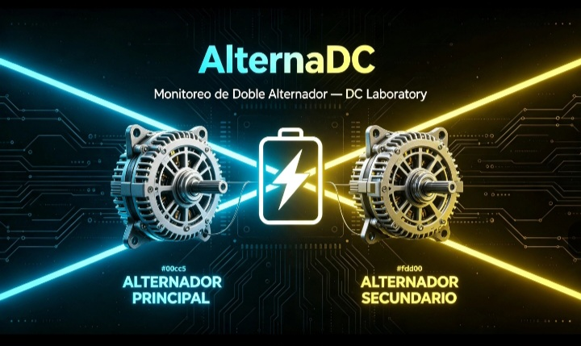

# ⚡ AlternaDC
### Monitoreo y Control de Energía — DC Laboratory

Sistema independiente para **monitorear y controlar dos alternadores** en tiempo real. Funciona sin internet: ves todo desde tu celular, pantalla o navegador.

---

## 📊 Lo que monitorea

| Canal | Color | Voltaje · Corriente · Potencia · Energía · % Carga |
|---|---|---|
| 🟦 **Alternador Principal** | Azul neón | ✅ En vivo |
| 🟨 **Alternador Secundario** | Amarillo neón | ✅ En vivo |

- **INA226 #1** → Dirección `0x40` → Principal 🟦
- **INA226 #2** → Dirección `0x41` → Secundario 🟨
- ESP32 recibe datos por I2C → transmite por WiFi
- Accede desde: `http://192.168.4.1`

---

## 💡 Control de Luces — Automático

El sistema decide solo según la energía disponible:

| Estado | Voltaje | Acción |
|---|---|---|
| ✅ Carga completa | > 13.8V | Encender luces extras, tiras neón, faros auxiliares |
| ⚠️ Carga media | 12.8V – 13.7V | Mantener luces esenciales, reducir brillo |
| 🔴 Batería baja | < 12.7V | Apagar luces extras automáticamente |

**Qué puedes conectar:**
- Tiras LED neón → resaltar carrocería
- Faros auxiliares → por relé controlado desde ESP32
- Luces del tablero → brillo automático
- Luces de alerta → parpadean si hay fallo

> Protege tu batería: nunca te quedas sin energía para arrancar ✅

---

## 🔊 Avisos de Sonido

- **Bocina conectada al ESP32:**
  - Encendido → tono confirmación ✅
  - Carga completa → doble aviso 🟦🟨
  - Voltaje bajo → alerta repetitiva ⚠️
  - Fallo en alternador → tono distintivo 🔴
- **Desde tu celular:** el tablero web reproduce avisos de voz o tonos personalizados

---

## 📱 Pantallas — Dónde ver todo

### 📲 Opción 1 — Tu celular (sin instalar nada)
- Abre: `http://192.168.4.1`
- Dos tarjetas grandes: Principal 🟦 · Secundario 🟨
- Gráficas en movimiento
- Botones para controlar luces manualmente

### 🖥️ Opción 2 — Pantalla fija en el tablero
- OLED o TFT conectada directo al ESP32
- Siempre visible sin tocar el celular
- Muestra voltaje, amperios, estado de luces, alertas

### 🚗 Opción 3 — Pantalla grande / Raspberry Pi
- Todo junto en una sola vista:
  - Datos del motor → desde DC-ELM327
  - Energía de los alternadores → desde AlternaDC
  - Control de luces y accesorios
- Con tu marca **DC Laboratory** en todo

---

## 🔌 Diagrama de Conexión

---

## 🛠️ Componentes que necesitas

| Pieza | Función |
|---|---|
| ESP32 Dev Board | Cerebro del sistema |
| Módulo INA226 × 2 | Medir voltaje y corriente de cada alternador |
| Shunt 50A–100A × 2 | Sensor de corriente alta |
| Módulo relés × 1–2 | Encender luces desde el ESP32 |
| Bocina piezoeléctrica | Avisos de sonido |
| Pantalla OLED 128×64 (opcional) | Visualización fija en tablero |
| Cables Dupont | Conexión entre módulos |

---

## 📂 Estructura del Proyecto

---

## 🔗 Repositorio Oficial

👉 **https://github.com/dcg0/AlternaDC**

© 2026 DC Laboratory — Código abierto
